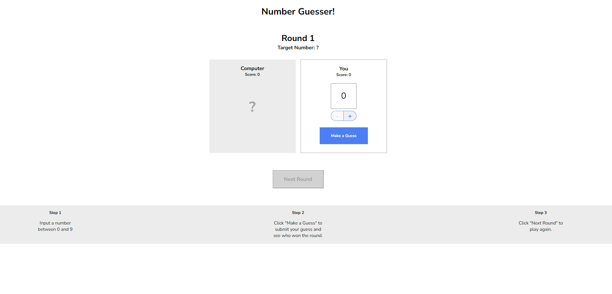

# Number Guesser

## Description
Number Guesser is a simple game where the player tries to guess a randomly generated number within a given range.

## Features
- Randomly generates a number within a specified range
- Allows the player to input their guess
- Provides feedback on whether the guess is too high or too low
- Keeps track of the number of attempts made by the player
- Notifies the player when they guess the correct number

## Technologies Used
- JavaScript
- HTML
- CSS

## Getting Started

###If you want to play on your computer locally:

1. Clone the repository: `git clone https://github.com/pc9350/number-guesser.git`
2. Open the `index.html` file in your web browser.
3. Start playing the game by entering your guess in the input field and clicking the "Guess" button.

###Direct Link to the Game: [Number-Guesser]('')

## Screenshots

## Contributing
Contributions are welcome! If you have any ideas or improvements, feel free to submit a pull request.

## Acknowledgements
- [Some resource or tutorial you used]
- [Any other acknowledgements]
